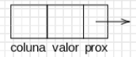
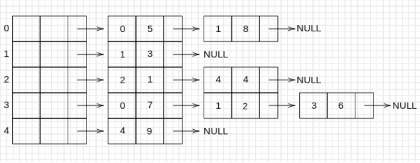
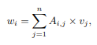

# Matriz Esparsa

Este trabalho de Estrutura de Dados consiste em multiplicar uma Matriz Esparsa por um vetor de forma que a complexidade assintótica das operações seja a menor possível.

## Enunciado

### Definição de Matrizes Esparsas

Uma matriz é uma tabela de números. Matrizes são muito utilizadas para representar entidades que possuem essa característica, e muitas vezes também usadas na modelagem de diversos problemas. Por vezes, problemas são modelados por matrizes gigantescas, que em muitos casos nem cabem na memória de um computador. Entretanto, na maioria das vezes essas matrizes possuem muitos elementos nulos. Matrizes com essa característica recebem o nome de matrizes esparsas.Na prática, armazenar elementos nulos é um desperdício de memória. Por isso, há várias formas de se representar matrizes esparsas. Todas essas formas armazenam apenas os elementos não nulos da matriz.Uma das formas é chamada CSR (do inglês,Compressed Sparse Row). Uma das maneiras de se representar uma matriz no formato CSR é utilizando **listas encadeadas** da seguinte forma: um vetor de nós-cabeça corresponde a cada linha da matriz, e cada linha é uma lista encadeada contendo apenas os elementos não nulos da respectiva linha. Cada nó da lista encadeada possui o seguinte formato:

    

Por exemplo, a matriz

      |5  8  0  0  0|
      |0  3  0  0  0|
      |0  0  1  0  4|
      |7  2  0  6  0|
      |0  0  0  0  9|

seria representada como

    

Em aplicações práticas, um dos interesses básicos é efetuar um produto matriz-vetor. Dada uma matriz A de dimensão m×n e um vetor v de dimensão n, o produto matriz-vetor de A por v resulta num vetor w de dimensão m tal que,

    

para i = 1,2, ... , m. Esse produto, assim implementado, custa O(n²). Esse custo, para matrizes muito grandes, pode ser inviável na prática.

### Tarefa

Sua tarefa é ler uma matriz esparsa de números inteiros com dimensão m×n e um vetor de números inteiros com dimensão n e imprimir na tela o resultado do produto da matriz pelo vetor. O produto deve ser calculado de forma eficiente.

### Entrada

A entrada é composta por várias linhas. A primeira linha contém os valores de m e n, respectivamente. As n linhas seguintes contêm as entradas do vetor. As demais linhas contêm os elementos não nulos da matriz, representados por três inteiros: a linha (um inteiro de 0 a m−1), a coluna (um inteiro de 0 a n−1) e o valor do elemento não nulo (um inteiro qualquer), respectivamente. A entrada termina com EOF.

### Saída

A saída é composta por m linhas, cada uma contendo o respectivo elemento do vetor resultante.

#### Exemplo de Entrada

    3 3
    9
    1
    4
    0 0 7
    1 1 4
    0 2 8
    2 1 2

#### Exemplo de Saída

    95
    4
    2

Author: John L. Gardenghi
